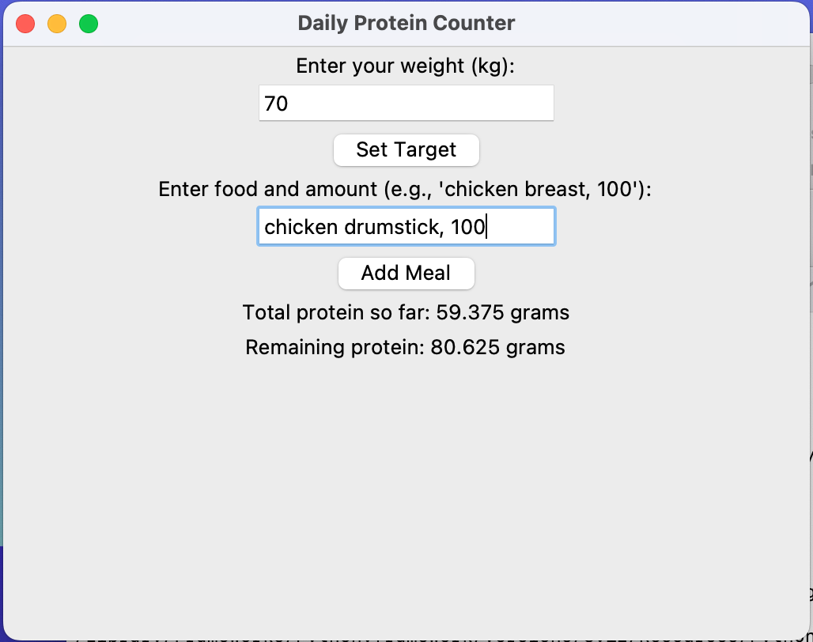

# Daily Protein Counter

A Python application to help users track their daily protein intake. The application provides both a command-line interface (CLI) and a graphical user interface (GUI).

## Features
- Calculate daily protein target based on user weight
- Add meals and track protein intake
- View remaining protein needed to meet daily target
- Switch between CLI and GUI versions

## Installation
Clone the repository:
```bash
git clone https://github.com/yourusername/protein-counter.git
cd protein-counter

## Usage

### GUI Version
```bash
python src/main.py

### CLI Version
python src/main.py cli

## Screenshots


## License
This project is licensed under the MIT License - see the LICENSE file for details.
